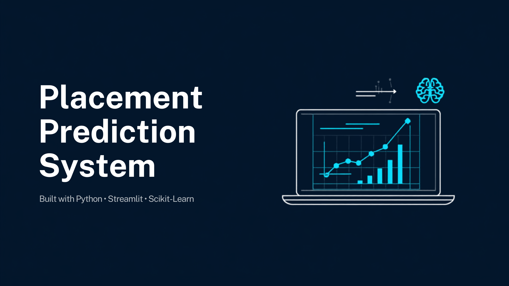
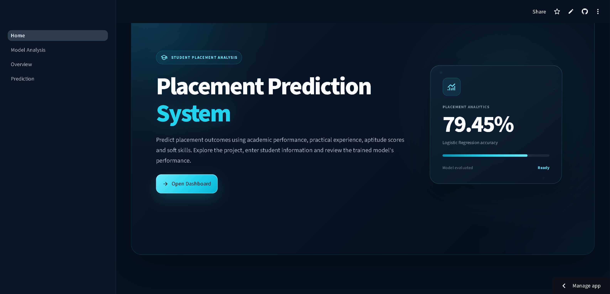
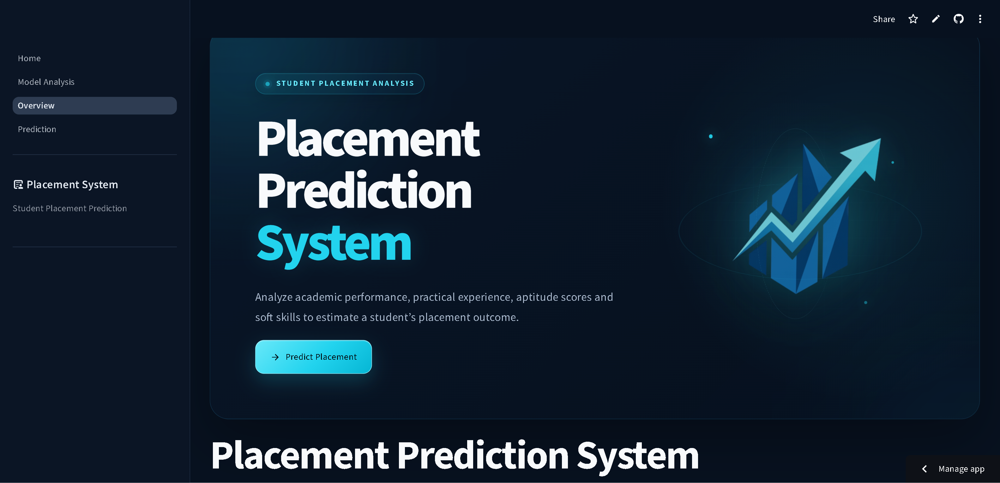
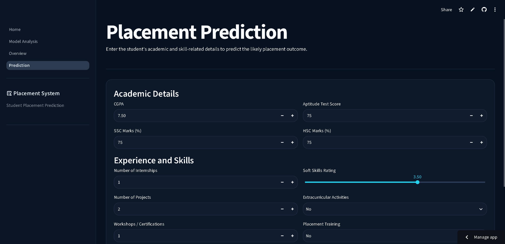
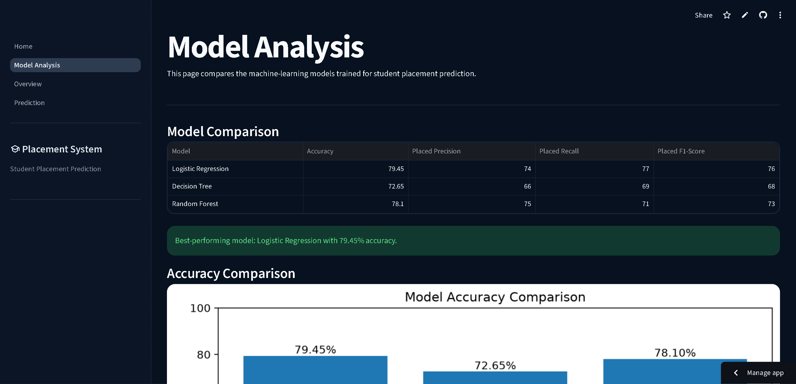

<p align="center">
  
</p>

<h1 align="center">🎓 Placement Prediction System</h1>

<p align="center">
An end-to-end Machine Learning web application that predicts student placement outcomes using Logistic Regression.
</p>

<p align="center">

<a href="https://placement-prediction-marsal.streamlit.app/">

</a>

<a href="https://github.com/Marsal8102-prime/Placement-Prediction-System">

</a>


</p>

## 🌐 Live Demo

Experience the application here:

👉 **https://placement-prediction-marsal.streamlit.app/**

## 📸 Application Preview

### 🏠 Home Page

<p align="center">

</p>

---

### 📊 Overview

<p align="center">

</p>

---

### 🤖 Prediction

<p align="center">

</p>

---

### 📈 Model Analysis

<p align="center">

</p>

## 🏗️ System Architecture

The application follows a simple end-to-end machine learning pipeline. User inputs are collected through the Streamlit interface, preprocessed using the saved `StandardScaler`, and then passed to the trained Logistic Regression model to generate placement predictions and confidence scores.

```text
                           👤 User
                              │
                              ▼
               ┌─────────────────────────┐
               │   Streamlit Web App     │
               │  (Home • Overview •     │
               │ Prediction • Analysis)  │
               └─────────────┬───────────┘
                             │
                             ▼
               ┌─────────────────────────┐
               │ Student Input Form      │
               │ • CGPA                  │
               │ • SSC & HSC Marks       │
               │ • Aptitude Score        │
               │ • Internships           │
               │ • Projects              │
               │ • Workshops             │
               │ • Soft Skills           │
               │ • Training Details      │
               └─────────────┬───────────┘
                             │
                             ▼
               ┌─────────────────────────┐
               │ Data Preprocessing      │
               │ StandardScaler          │
               └─────────────┬───────────┘
                             │
                             ▼
               ┌─────────────────────────┐
               │ Logistic Regression     │
               │ Trained ML Model        │
               └─────────────┬───────────┘
                             │
                 ┌───────────┴───────────┐
                 ▼                       ▼
      Placement Prediction      Probability Scores
                 │                       │
                 └───────────┬───────────┘
                             ▼
               ┌─────────────────────────┐
               │ Prediction Dashboard    │
               │ • Result                │
               │ • Confidence            │
               │ • Model Analysis        │
               └─────────────────────────┘
```

### Workflow

1. The user enters academic, technical, and extracurricular details through the Streamlit interface.
2. The input data is validated and transformed using the saved **StandardScaler**.
3. The scaled features are passed to the trained **Logistic Regression** model.
4. The model predicts whether the student is likely to be **Placed** or **Not Placed**.
5. The prediction probabilities are displayed along with an intuitive results dashboard.
6. Users can explore model performance through comparison tables, evaluation metrics, confusion matrix, and feature importance visualizations.


## ⚙️ Running the Project Locally

Follow these steps to set up and run the application on your local machine.

### Prerequisites

Ensure you have the following installed:

- Python **3.12**
- Git
- pip (Python Package Manager)

---

### 1. Clone the Repository

```bash
git clone https://github.com/Marsal8102-prime/Placement-Prediction-System.git
```

---

### 2. Navigate to the Project Directory

```bash
cd Placement-Prediction-System
```

---

### 3. Create a Virtual Environment

**Windows**

```bash
python -m venv .venv
.venv\Scripts\activate
```

**macOS / Linux**

```bash
python3 -m venv .venv
source .venv/bin/activate
```

---

### 4. Install Dependencies

```bash
pip install --upgrade pip
pip install -r requirements.txt
```

---

### 5. Run the Streamlit Application

```bash
streamlit run Home.py
```

Once the server starts, open your browser and visit:

```text
http://localhost:8501
```

---

### 6. Stop the Application

To stop the application, press:

```text
Ctrl + C
```

in the terminal.

---

## 📁 Required Project Files

Before running the application, ensure the following files are present in the project root:

```text
Placement-Prediction-System/
│
├── Home.py
├── placement_model.pkl
├── scaler.pkl
├── requirements.txt
├── assets/
├── pages/
├── styles/
└── utils/
```

---

## 🛠 Troubleshooting

### Streamlit command not found

Run the application using:

```bash
python -m streamlit run Home.py
```

### Dependency Issues

If you encounter package compatibility issues, reinstall the dependencies:

```bash
pip install --upgrade pip
pip install -r requirements.txt
```

> **Note:** This project was developed and tested with **Python 3.12** and **scikit-learn 1.6.1**. Using the versions specified in `requirements.txt` is recommended for the best compatibility.

 ---
> *Developed by Ritik Kumar (Marsal)*
